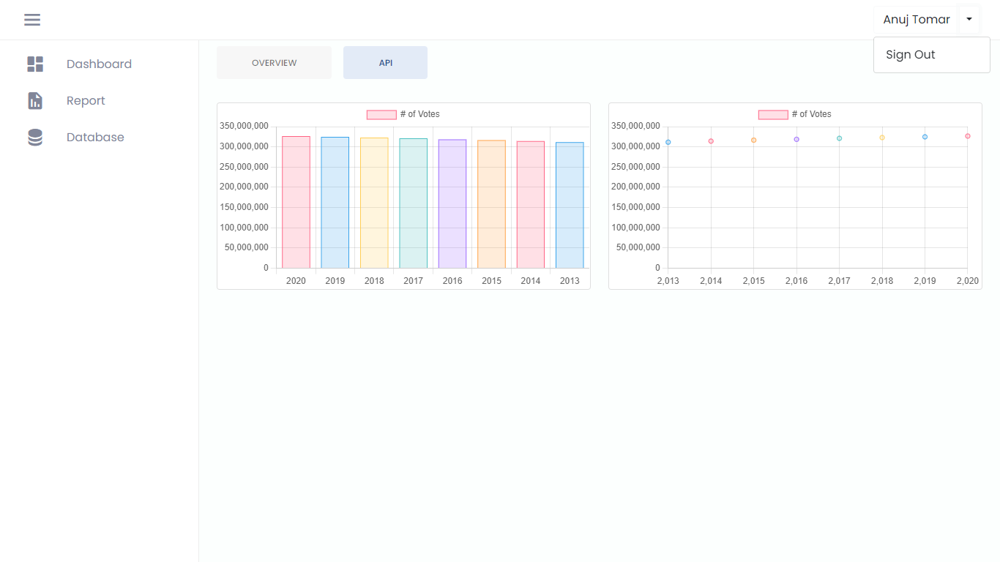

# My Angular Lab

This repository is where I learn, experiment, and record my creative and logical outputs. The repository is live on Netlify, and below is the link to view the output.

## 🔗Attached Link

https://angular-lab.netlify.app/home

### Theme 1

### Theme 2

